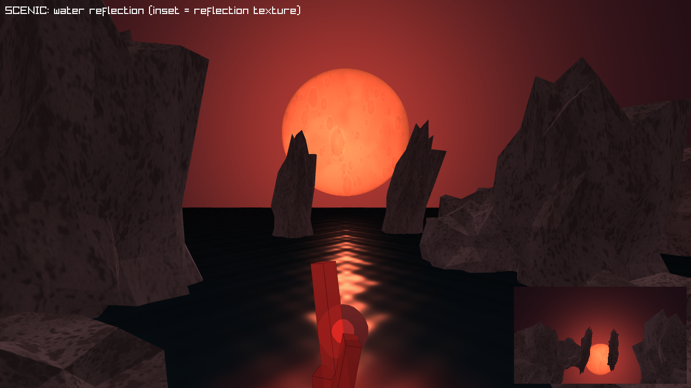
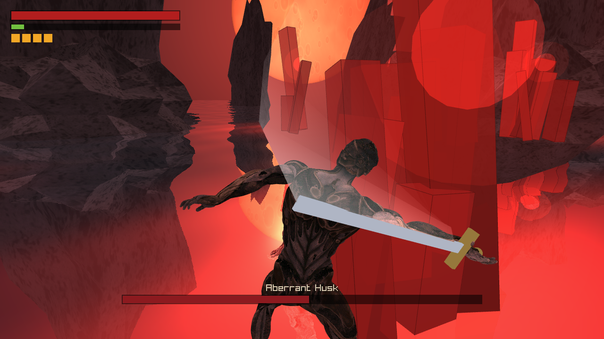
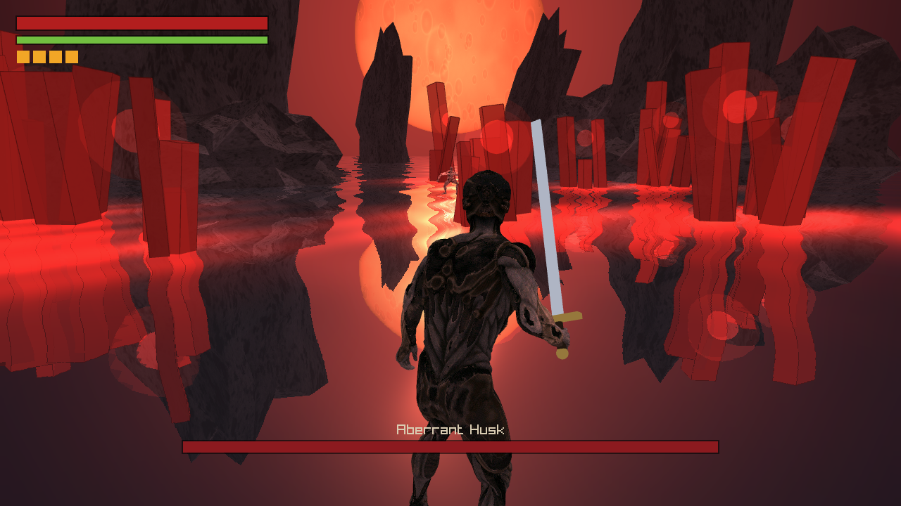
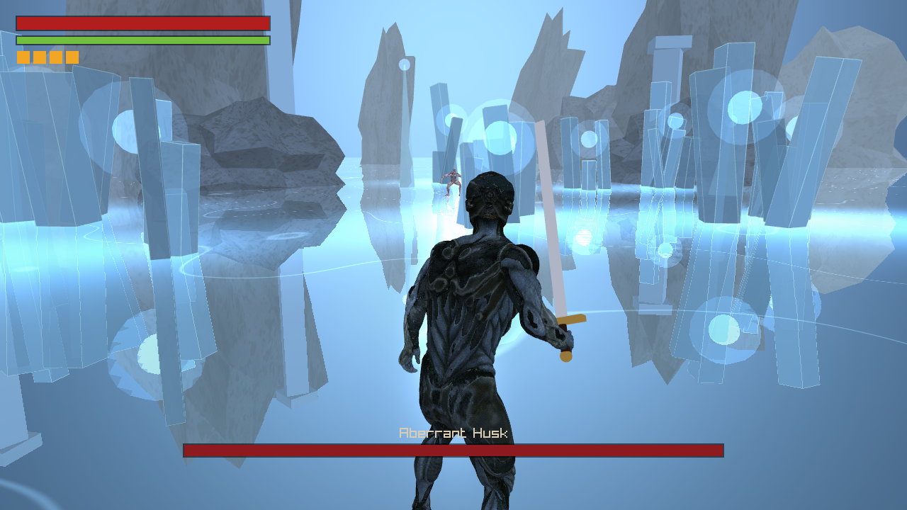

# Soulslike — Boss Arena (raylib / C++)

A faithful port of the Godot 4 souls-like boss-fight (`dark-souls/souls-game`) to
**raylib + C++**, reusing the original Mixamo character models, animations, audio,
and VFX textures. One arena, one relentless undead boss, deliberate stamina-gated
combat.

> Original design: `info.md` / `plan.md` / `logs.md` in the Godot project.

## Screenshots

| Moonlit ruin — blood moon, sky dome & reflective water | The fight — sword trail, attack telegraphs, crystal light |
| :---: | :---: |
|  |  |



*Planar-reflective water with a moonlight glade, cloudy-red gem crystals that cast
red light onto the rocks and fighters, a soft white sword trail, impact waves, and
parry (orange) / unblockable (red) attack telegraphs.*

## Features (ported 1:1 from the GDScript)

- **Player**: camera-relative 8-dir movement, sprint, third-person camera with
  **lock-on**, stamina, **i-frame dodge**, 3-hit light combo + heavy attack with
  buffered chaining, **block / guard**, **parry → riposte takedown**, **estus
  flask** heal, hit reactions and death.
- **Boss**: FSM `sleep → roar → chase → attack` with **wind-up telegraphs**
  (red = blockable, orange = unblockable), attack **combo strings**, **poise /
  stagger**, a **phase-2 enrage at 50% HP**, and a death sequence.
- **Combat**: geometric hitbox↔hurtbox (sphere vs capsule), one-hit-per-swing,
  i-frame invulnerability, knockback, hit-stop, camera shake, blood VFX.
- **Arena**: the moonlit ruin glb, flat floor + cylindrical "fog-wall" boundary,
  blood moon, animated red crystals, dark reflective water, footstep ripples.
- **UI**: HP / stamina bars, estus pips, boss HP bar, lock-on reticle, takedown
  prompt, title / YOU DIED / VICTORY screens, pause menu with volume + sensitivity.
- **Audio**: SFX pool + crossfading ambient/fight music.

## Controls

| Action | Key |
| --- | --- |
| Move | `W A S D` |
| Sprint | `Shift` (hold) |
| Camera | Mouse |
| Dodge (i-frames) | `Space` |
| Light attack | `Left Mouse` |
| Heavy attack | `Right Mouse` |
| Block / parry | `Q` (hold; tap just before a blockable hit to parry) |
| Takedown (after a parry) | `E` |
| Heal (estus) | `R` |
| Lock-on | `Tab` / `Middle Mouse` |
| Pause | `Esc` |

Walk forward to wake the Husk. Parry a **red**-telegraphed attack, then press `E`
for a takedown. **Dodge** orange (unblockable) attacks — they cannot be parried.

## Build

Requires a C++17 compiler and CMake. raylib 5.5 is fetched and built automatically
via CMake `FetchContent` (needs internet + git on the first configure).

**Windows (MSVC):** just run `build.bat` (it locates VS Build Tools' MSVC + bundled
CMake/Ninja). The executable lands at `build/dark_souls_raylib.exe`.

**Any platform:**
```sh
cmake -S . -B build -DCMAKE_BUILD_TYPE=Release
cmake --build build
```

Run from the project root so the baked `ASSET_DIR` resolves:
```sh
./build/dark_souls_raylib.exe          # default: the blood-moon ruin
./build/dark_souls_raylib.exe ice      # the Frozen Cathedral level
```
(Pass `auto` for a hands-free demo, `scenic` for a fly-by of the arena; flags combine, e.g. `ice scenic`.)

## Levels

| Blood-Moon Ruin (default) | Frozen Cathedral (`ice`) |
| :---: | :---: |
|  |  |

The **Frozen Cathedral** is a second level (`int g_level` / `LEVEL_FROZEN`) that re-themes
the shared rendering pipeline: cold overcast lighting, a moonless pale-blue sky dome
(`sky_ice.fs`), a frozen reflective lake (`water_ice.fs`), ice-blue bioluminescent
crystals, and a procedural ruined gothic colonnade + jagged ice spires (`arena.cpp`
`draw_ice_props`). Concept art and the build spec live in [`design/`](design/) — the
concept was drafted with the Codex CLI from `design/frozen_cathedral_design.md`.

## Asset pipeline (FBX → glb)

raylib cannot load FBX, so the rigged characters + every animation clip were
exported to `.glb` (which raylib loads with skeletal animation) using the on-machine
Godot 4.4.1 headless and `tools/export_glb.gd` in the original project. The exporter
strips each FBX's bundled bind clip and parents a single `AnimationPlayer` (holding
all 34 player / 12 enemy clips) **inside** the model so the `Skeleton3D:bone` track
paths resolve for the glTF exporter.

**Then** the exported glb is run through `tools/fix_glb_skin.py` to make it
raylib-compatible — Godot exports skins with **8 bone influences per vertex**
(`JOINTS_1`/`WEIGHTS_1`) and **non-topologically-sorted bones**, neither of which
raylib's CPU skinning supports (the result is collapsed/invisible body meshes). The
script reduces each vertex to its top-4 renormalized influences and sorts the joints
parent-before-child. Verify with `tools/inspect_glb.py`. The arena glb, audio, and
VFX textures are copied across as-is. See `assets/`.

## Layout

```
src/
  main.cpp        loop, pause, restart wiring (world.gd)
  game / events   state machine + signal bus (autoloads)
  combat          Hit / Health / Stamina / Hitbox / Hurtbox
  player, boss    the two FSM controllers
  arena           glb + blood-moon / water / crystals + collision
  anim            skeletal animation driver (named clips, fitted playback)
  hud, screens, pause_menu, audio_sys, fx, juice, render
assets/
  characters/*.glb  arena/*.glb  audio/  textures/  shaders/
```

## Known simplifications vs. the Godot original

- Planar water reflection is rendered with a water-mirrored camera into a render
  texture and sampled (with a widened mirror FOV so edge objects like the moon are
  captured) — close to the Godot SubViewport approach, minus per-object clipping.
- Only the two arena rocks that intrude into the playable ring get collision; the
  distant monoliths/spires are outside the boundary ring and need none.
- Finger-bone animation is dropped (the Mixamo finger tracks don't survive the
  glTF export); body animation is intact.
